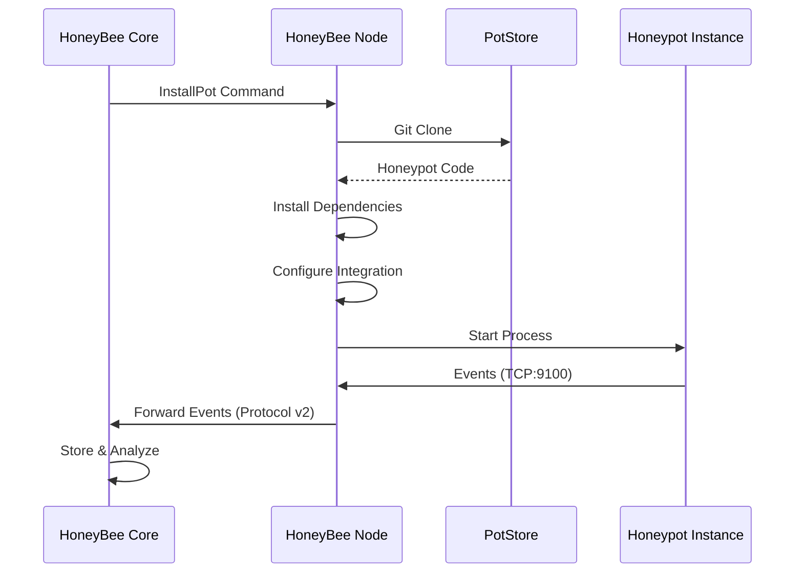

<div align="center">

# 🍯 HoneyBee PotStore

**The Official Honeypot Repository for Distributed Threat Intelligence**

[](https://opensource.org/licenses/MIT)
[](https://github.com/H0neyBe/honeybee_core)
[](https://github.com/H0neyBe/honeybee_potstore)
[](https://github.com/H0neyBe/honeybee_potstore)

**Repository:** [`github.com/H0neyBe/honeybee_potstore`](https://github.com/H0neyBe/honeybee_potstore)

[Quick Start](#-quick-start) • [Available Honeypots](#-available-honeypots) • [Documentation](#-documentation) • [Contributing](#-contributing)

</div>

---

## 🌟 About

**HoneyBee PotStore** is the premier collection of production-ready honeypots designed for the [HoneyBee](https://github.com/H0neyBe/honeybee_core) distributed honeypot orchestration framework. Think of it as the **App Store for honeypots** – a curated repository where security professionals can discover, deploy, and manage honeypots with zero configuration overhead.

### Why PotStore?

🔒 **Enterprise-Ready** | 🚀 **Zero-Config Deployment** | 🔄 **Auto-Integration** | 🌐 **Multi-Protocol** | 📊 **Real-Time Intelligence**

Every honeypot in PotStore is:
- ✅ **Pre-configured** with HoneyBee integration built-in
- ✅ **Battle-tested** in production environments
- ✅ **Automatically managed** by HoneyBee nodes
- ✅ **Cross-platform** compatible (Linux, Windows, macOS)
- ✅ **Event-driven** with real-time threat intelligence

> **💡 Pro Tip:** Nodes automatically pull honeypots from PotStore when you deploy new instances. No manual configuration required!

---

## ⚡ Quick Start

Deploy your first honeypot in **under 60 seconds**:

```json
{
  "version": 2,
  "message": {
    "NodeCommand": {
      "node_id": 12345,
      "command": {
        "InstallPot": {
          "pot_id": "cowrie-01",
          "honeypot_type": "cowrie",
          "config": {
            "ssh_port": "2222",
            "telnet_port": "2223"
          },
          "auto_start": true
        }
      }
    }
  }
}
```

**What happens next?**
1. 🎯 Node clones PotStore repository
2. 📦 Installs dependencies automatically
3. ⚙️ Configures HoneyBee integration
4. 🚀 Starts honeypot (if `auto_start: true`)
5. 📡 Events flow to Core in real-time

---

## 🎯 Available Honeypots

### Production Ready

| Honeypot | 🏷️ Type | 📡 Protocols | 📦 Version | ✅ Status | 📝 Description |
|----------|---------|-------------|------------|-----------|----------------|
| **🐄 Cowrie** | SSH/Telnet | SSH, Telnet | `2.9.0` | 🟢 Stable | Medium to high interaction SSH/Telnet honeypot with advanced command logging |
| **🪄 HonnyPotter** | WordPress | HTTP, HTTPS | `1.2.0` | 🟢 Stable | WordPress login honeypot capturing brute-force attacks and credential stuffing |

---

### 🐄 Cowrie - SSH/Telnet Honeypot

**The Swiss Army Knife of SSH Honeypots**

<details>
<summary><b>Click to expand features and details</b></summary>

#### ✨ Features

- 🔐 **SSH Honeypot** - Full SSH protocol emulation
- 📞 **Telnet Honeypot** - Legacy protocol support
- 📝 **Command Logging** - Track every command executed
- 📥 **File Download Tracking** - Monitor malware downloads
- 🎬 **Session Recording** - Complete session replay
- 🔌 **Custom Plugins** - Extensible architecture
- 🐍 **Python 3.7+** - Modern Python support

#### 🔧 Default Configuration

```yaml
SSH Port:    2222
Telnet Port: 2223
Hostname:    honeybee-{pot_id}
Log Path:    var/log/cowrie
```

#### 📦 Installation

```bash
# Automatic (via HoneyBee Node)
# Or manual installation:
cd cowrie
python3 -m venv venv
source venv/bin/activate
pip install -r requirements.txt
```

#### 🎯 Use Cases

- Detecting SSH brute-force attacks
- Monitoring credential stuffing attempts
- Tracking attacker behavior and techniques
- Collecting malware samples
- Research and threat intelligence

</details>

---

### 🪄 HonnyPotter - WordPress Honeypot

**The Silent Guardian of Web Applications**

<details>
<summary><b>Click to expand features and details</b></summary>

#### ✨ Features

- 🌐 **WordPress Emulation** - Realistic login interface
- 🔨 **Brute-Force Detection** - Identify attack patterns
- 📋 **Credential Logging** - Capture stolen credentials
- 🔗 **XML-RPC Support** - Detect API-based attacks
- ⚡ **Low Resource Usage** - Minimal footprint
- 🗄️ **No Database** - Standalone operation
- 🔌 **Plugin Mode** - WordPress integration option

#### 🔧 Default Configuration

```yaml
HTTP Port:   8080 (configurable)
HTTPS Port:  443
Mode:        Standalone or WordPress Plugin
```

#### 📦 Installation

```bash
# Automatic (via HoneyBee Node)
# Or manual installation:
cd HonnyPotter
chmod +x install.sh
./install.sh
```

#### 🎯 Use Cases

- WordPress brute-force detection
- Credential stuffing monitoring
- Web application attack analysis
- Threat intelligence gathering
- Security research

</details>

---

## 🚀 Future Work

### Coming Soon

We're building the **most comprehensive honeypot collection** in the industry. Here's what's on the roadmap:

| Honeypot | 📡 Protocols | 🎯 Status | 📝 Description |
|----------|-------------|-----------|----------------|
| **🦎 Dionaea** | FTP, HTTP, SMB, MySQL | 🚧 In Development | Low interaction multi-protocol honeypot |
| **📢 Heralding** | Multiple | 🚧 Planned | Credential honeypot for multiple protocols |
| **🔍 Elasticpot** | HTTP | 🚧 Planned | Elasticsearch honeypot for search engine attacks |
| **📧 Mailoney** | SMTP | 🚧 Planned | SMTP honeypot for email-based attacks |
| **🌐 Glastopf** | HTTP, HTTPS | 🚧 Planned | Web application honeypot |
| **🔐 Kippo** | SSH | 🚧 Planned | Legacy SSH honeypot (compatibility) |

### 🎁 Upcoming Features

- 🔄 **Version Management** - Multiple honeypot versions support
- 🏪 **Custom Registry** - Add your own honeypots
- 🧪 **Automated Testing** - CI/CD validation pipeline
- 🐳 **Docker Support** - Containerized deployments
- 📋 **Config Templates** - Pre-built configuration profiles
- ✅ **Schema Validation** - Standardized event format validation
- 📊 **Analytics Dashboard** - Real-time threat visualization
- 🔔 **Alert System** - Intelligent threat notifications

### 🤝 Contributing

**We ❤️ contributors!** Help us build the future of honeypot orchestration.

See our [Contributing Guidelines](CONTRIBUTING.md) for:
- ➕ Adding new honeypots
- 🔧 Improving existing honeypots
- 🐛 Reporting issues
- 💡 Suggesting features
- 📚 Writing documentation

---

## 🏗️ Architecture

### System Overview

```
┌─────────────────────────────────────────────────────────────┐
│                    HoneyBee Ecosystem                        │
└─────────────────────────────────────────────────────────────┘

┌─────────────────┐
│  HoneyBee Core  │  ← Central Orchestration Manager
│   (Manager)     │     • Node Management
└────────┬────────┘     • Event Aggregation
         │              • Command Distribution
         │ Protocol v2
         │
┌────────▼────────┐
│  HoneyBee Node  │  ← Honeypot Installer & Manager
│  (Installer)    │     • Git Operations
└────────┬────────┘     • Dependency Management
         │              • Process Control
         │ Git Clone
         │
┌────────▼────────┐      ┌──────────────┐
│  PotStore Repo  │─────▶│  Honeypot     │  ← Threat Detection
│  (This Repo)    │      │  Instance    │     • Attack Capture
└─────────────────┘      └──────┬───────┘     • Event Generation
                                  │
                                  │ Events (TCP:9100)
                                  │ JSON Lines
                          ┌───────▼───────┐
                          │  HoneyBee    │  ← Event Forwarder
                          │    Node      │     • Event Collection
                          └──────┬───────┘     • Protocol Conversion
                                  │
                                  │ Protocol v2
                          ┌───────▼───────┐
                          │  HoneyBee    │  ← Intelligence Hub
                          │    Core      │     • Event Storage
                          └──────────────┘     • Analytics
                                                 • Alerting
```

### 🔄 Workflow



**Step-by-Step:**

1. **🎯 Command** - Core sends `InstallPot` command to node
2. **📥 Clone** - Node clones PotStore repository
3. **📦 Extract** - Node extracts specified honeypot
4. **⚙️ Install** - Node installs dependencies automatically
5. **🔧 Configure** - Node configures HoneyBee integration
6. **🚀 Start** - Node starts honeypot (if `auto_start: true`)
7. **📡 Events** - Honeypot sends events to node via TCP
8. **🔄 Forward** - Node forwards events to Core via Protocol v2
9. **📊 Analyze** - Core stores and analyzes events

---

## 📡 Protocol v2 - Commands Reference

### 🎯 Install Pot

Install a honeypot from PotStore or custom Git repository:

```json
{
  "version": 2,
  "message": {
    "NodeCommand": {
      "node_id": 12345,
      "command": {
        "InstallPot": {
          "pot_id": "cowrie-01",
          "honeypot_type": "cowrie",
          "git_url": null,
          "git_branch": null,
          "config": {
            "ssh_port": "2222",
            "telnet_port": "2223",
            "hostname": "honeybee-cowrie"
          },
          "auto_start": true
        }
      }
    }
  }
}
```

**📋 Parameters:**

| Parameter | Type | Required | Description |
|-----------|------|----------|-------------|
| `pot_id` | string | ✅ Yes | Unique identifier for this instance |
| `honeypot_type` | string | ✅ Yes | Type: `cowrie`, `honnypotter`, etc. |
| `git_url` | string | ❌ No | Custom Git URL (defaults to PotStore) |
| `git_branch` | string | ❌ No | Git branch (defaults to `main`) |
| `config` | object | ❌ No | Honeypot-specific configuration |
| `auto_start` | boolean | ❌ No | Start after installation (default: `false`) |

> **💡 Tip:** Set `git_url: null` to use PotStore automatically.

### ▶️ Deploy (Start) Pot

Start a honeypot instance:

```json
{
  "version": 2,
  "message": {
    "NodeCommand": {
      "node_id": 12345,
      "command": {
        "DeployPot": "cowrie-01"
      }
    }
  }
}
```

### ⏹️ Stop Pot

Stop a running honeypot:

```json
{
  "version": 2,
  "message": {
    "NodeCommand": {
      "node_id": 12345,
      "command": {
        "StopPot": "cowrie-01"
      }
    }
  }
}
```

### 🔄 Restart Pot

Restart a honeypot instance:

```json
{
  "version": 2,
  "message": {
    "NodeCommand": {
      "node_id": 12345,
      "command": {
        "RestartPot": "cowrie-01"
      }
    }
  }
}
```

### 📊 Get Pot Status

Get current status of a honeypot:

```json
{
  "version": 2,
  "message": {
    "NodeCommand": {
      "node_id": 12345,
      "command": {
        "GetPotStatus": "cowrie-01"
      }
    }
  }
}
```

**📥 Response:**

```json
{
  "version": 2,
  "message": {
    "PotStatusUpdate": {
      "node_id": 12345,
      "pot_id": "cowrie-01",
      "pot_type": "cowrie",
      "status": "Running",
      "message": "Honeypot is active and receiving connections"
    }
  }
}
```

### 📋 Get All Installed Pots

List all installed honeypots on a node:

```json
{
  "version": 2,
  "message": {
    "NodeCommand": {
      "node_id": 12345,
      "command": {
        "GetInstalledPots": {}
      }
    }
  }
}
```

---

## 🔌 Event Integration

### 📡 Event Flow

```
┌──────────┐      TCP:9100      ┌──────────┐   Protocol v2   ┌──────────┐
│ Honeypot │ ──── JSON Lines ──▶│   Node   │ ──── Events ────▶│   Core   │
└──────────┘                    └──────────┘                 └──────────┘
```

### 📝 Event Format

Events are sent as **JSON Lines** (one JSON object per line) to `localhost:9100`:

```json
{
  "eventid": "cowrie.login.success",
  "src_ip": "192.168.1.100",
  "src_port": 54321,
  "dst_port": 2222,
  "username": "admin",
  "password": "password123",
  "session": "abc123",
  "message": "Login successful",
  "timestamp": "2024-01-15T10:30:00Z"
}
```

### 🎯 Event Types

#### 🐄 Cowrie Events

| Event Type | Description | Data Fields |
|------------|-------------|-------------|
| `cowrie.login.success` | Successful login | `username`, `password`, `src_ip` |
| `cowrie.login.failed` | Failed login attempt | `username`, `password`, `src_ip` |
| `cowrie.command.input` | Command executed | `input`, `session`, `src_ip` |
| `cowrie.session.file_download` | File downloaded | `url`, `outfile`, `session` |
| `cowrie.session.closed` | Session terminated | `session`, `duration` |

#### 🪄 HonnyPotter Events

| Event Type | Description | Data Fields |
|------------|-------------|-------------|
| `honnypotter.login.failed` | Failed login | `username`, `password`, `ip` |
| `honnypotter.xmlrpc.attack` | XML-RPC attack | `method`, `username`, `ip` |
| `honnypotter.bruteforce.detected` | Brute-force detected | `ip`, `attempts`, `timeframe` |

---

## ➕ Adding New Honeypots

### 📋 Requirements Checklist

- [ ] ✅ Installable (Python: `pip install -r requirements.txt` or PHP: standalone)
- [ ] ✅ Python 3.7+ or PHP 7.4+ support
- [ ] ✅ Event forwarding to TCP socket `localhost:9100`
- [ ] ✅ JSON format (one event per line)
- [ ] ✅ Installation instructions included
- [ ] ✅ HoneyBee integration code provided

### 🛠️ Implementation Steps

1. **📁 Create Directory**
   ```bash
   mkdir honeybee_potstore/your-honeypot
   cd your-honeypot
   ```

2. **📦 Add Requirements**
   - Python: `requirements.txt`
   - PHP: `composer.json` or standalone

3. **🔌 Implement Event Forwarding**
   - Send events to `localhost:9100`
   - Use JSON Lines format

4. **⚙️ Add HoneyBee Integration**
   - Output plugin (Python)
   - Forwarder script (PHP)

5. **📝 Update Manifest**
   - Add entry to `potstore.json`

6. **🧪 Test Installation**
   - Verify installation works
   - Test event forwarding

7. **📤 Submit PR**
   - Create pull request
   - Include documentation

### 💻 Code Examples

#### 🐍 Python Integration

```python
# honeybee-integration/honeybee.py
import json
import socket
import os
from datetime import datetime

class HoneyBeeOutput:
    def __init__(self):
        self.port = int(os.getenv('HONEYBEE_EVENT_PORT', '9100'))
        self.pot_id = os.getenv('HONEYBEE_POT_ID', 'honeypot-01')
    
    def send_event(self, event_type, data):
        event = {
            "pot_id": self.pot_id,
            "event_type": event_type,
            "timestamp": datetime.utcnow().isoformat() + "Z",
            "data": data
        }
        
        try:
            sock = socket.socket(socket.AF_INET, socket.SOCK_STREAM)
            sock.connect(('localhost', self.port))
            sock.sendall((json.dumps(event) + '\n').encode())
            sock.close()
        except Exception as e:
            print(f"Failed to send event: {e}")
```

#### 🐘 PHP Integration

```php
<?php
// honeybee-forwarder.php
function sendToHoneyBee($eventData) {
    $port = (int)($_ENV['HONEYBEE_EVENT_PORT'] ?? 9100);
    $potId = $_ENV['HONEYBEE_POT_ID'] ?? 'honeypot-01';
    
    $event = [
        'pot_id' => $potId,
        'event_type' => $eventData['event_type'],
        'timestamp' => date('c'),
        'data' => $eventData
    ];
    
    $socket = @fsockopen('localhost', $port, $errno, $errstr, 1);
    if ($socket) {
        fwrite($socket, json_encode($event) . "\n");
        fclose($socket);
        return true;
    }
    return false;
}
?>
```

---

## 🧪 Testing

### 🐄 Testing Cowrie

<details>
<summary><b>Click to expand testing guide</b></summary>

#### Step 1: Clone Repository
```bash
git clone https://github.com/H0neyBe/honeybee_potstore.git
cd honeybee_potstore/cowrie
```

#### Step 2: Install Dependencies
```bash
python3 -m venv venv
source venv/bin/activate  # Windows: venv\Scripts\activate
pip install -r requirements.txt
```

#### Step 3: Configure Output
Edit `etc/cowrie.cfg`:
```ini
[output_socketlog]
enabled = true
address = 127.0.0.1:9100
timeout = 5
```

#### Step 4: Start Honeypot
```bash
bin/cowrie start
```

#### Step 5: Test Connection
```bash
ssh -p 2222 admin@localhost
# Try: ls, whoami, exit
```

#### Step 6: Verify Events
Check that events are sent to `localhost:9100`

</details>

### 🪄 Testing HonnyPotter

<details>
<summary><b>Click to expand testing guide</b></summary>

#### Step 1: Clone Repository
```bash
git clone https://github.com/H0neyBe/honeybee_potstore.git
cd honeybee_potstore/HonnyPotter
```

#### Step 2: Install
```bash
chmod +x install.sh
./install.sh
```

#### Step 3: Start PHP Server
```bash
php -S 0.0.0.0:8080 standalone.php
```

#### Step 4: Test Login Endpoint
```bash
curl -X POST http://localhost:8080/standalone.php \
  -d "log=admin&pwd=password123"
```

#### Step 5: Verify Events
Check that events are sent to HoneyBee Node

</details>

---

## ⚙️ Configuration

### 🔧 Supported Configuration Keys

| Key | Type | Default | Description |
|-----|------|---------|-------------|
| `ssh_port` | string | `"2222"` | SSH port for Cowrie |
| `telnet_port` | string | `"2223"` | Telnet port for Cowrie |
| `http_port` | string | `"8080"` | HTTP port for HonnyPotter |
| `https_port` | string | `"443"` | HTTPS port |
| `hostname` | string | `"honeybee-{id}"` | Honeypot hostname |
| `log_path` | string | `"var/log"` | Log directory |
| `data_path` | string | `"var/lib"` | Data directory |
| `pot_id` | string | `"{id}"` | Honeypot instance ID |

### 🌍 Environment Variables

HoneyBee Node automatically sets these for honeypots:

| Variable | Default | Description |
|----------|---------|-------------|
| `HONEYBEE_EVENT_PORT` | `9100` | Port to send events to |
| `HONEYBEE_POT_ID` | `{pot_id}` | Honeypot instance ID |
| `HONEYBEE_HONEYPOT_TYPE` | `{type}` | Honeypot type |
| `HONEYBEE_ENABLE` | `true` | Enable integration |

---

## 🔧 Troubleshooting

### ❌ Installation Fails

**Symptoms:** Honeypot installation fails with errors

**Solutions:**
1. ✅ Check Python/PHP is installed: `python3 --version` or `php -v`
2. ✅ Verify Git is available: `git --version`
3. ✅ Check disk space: `df -h`
4. ✅ Review node logs for detailed errors
5. ✅ Ensure network connectivity to GitHub

### 🚫 Honeypot Won't Start

**Symptoms:** Installation succeeds but honeypot fails to start

**Solutions:**
1. ✅ Verify all dependencies installed
2. ✅ Check configuration file is valid
3. ✅ Ensure ports are not in use: `netstat -tuln | grep 2222`
4. ✅ Review honeypot logs
5. ✅ Check file permissions

### 📡 Events Not Forwarding

**Symptoms:** Honeypot runs but events don't reach Core

**Solutions:**
1. ✅ Verify event listener on port 9100: `netstat -tuln | grep 9100`
2. ✅ Check honeypot output plugin configuration
3. ✅ Verify network connectivity
4. ✅ Enable debug logging
5. ✅ Check firewall rules

### 🔌 Port Conflicts

**Symptoms:** Port already in use error

**Solutions:**
1. ✅ Change port in configuration
2. ✅ Stop conflicting service
3. ✅ Use different port range

---

## 📚 Documentation

- 📖 [Complete Documentation](https://github.com/H0neyBe/bee_docs)
- 🔌 [Protocol v2 Specification](https://github.com/H0neyBe/bee_docs/blob/main/src/protocol/protocol.md)
- 🎯 [Honeypot Integration Guide](https://github.com/H0neyBe/bee_docs/blob/main/src/potstore/integration.md)
- ➕ [Adding New Honeypots](https://github.com/H0neyBe/bee_docs/blob/main/src/potstore/adding.md)

---

## 🔗 Related Projects

| Project | Description | Link |
|---------|-------------|------|
| **🍯 HoneyBee Core** | Central orchestration manager | [GitHub](https://github.com/H0neyBe/honeybee_core) |
| **🖥️ HoneyBee Node** | Honeypot node implementation | [GitHub](https://github.com/H0neyBe/honeybee_node) |
| **📚 Bee Docs** | Complete documentation | [GitHub](https://github.com/H0neyBe/bee_docs) |

---

## 💬 Support & Community

- 🐛 **Issues:** [GitHub Issues](https://github.com/H0neyBe/honeybee_potstore/issues)
- 💬 **Discussions:** [GitHub Discussions](https://github.com/H0neyBe/honeybee_potstore/discussions)
- 📧 **Email:** [Contact Maintainers](mailto:maintainers@honeybee.dev)

---

## 📄 License

This project is licensed under the **MIT License** - see the [LICENSE](LICENSE) file for details.

---

<div align="center">

**Made with ❤️ by the HoneyBee Team**

[⭐ Star us on GitHub](https://github.com/H0neyBe/honeybee_potstore) • [🐛 Report Bug](https://github.com/H0neyBe/honeybee_potstore/issues) • [💡 Request Feature](https://github.com/H0neyBe/honeybee_potstore/issues)

</div>
